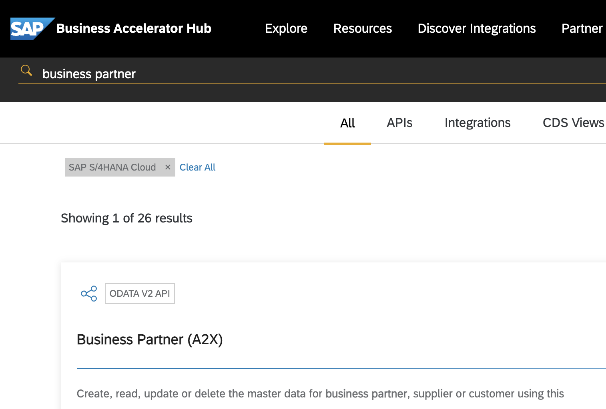

# Create a Service Mashup using the SAP Cloud Application Programming Model

It contains these folders and files, following our recommended project layout:

| File or Folder | Purpose                              |
| -------------- | ------------------------------------ |
| `app/`         | content for frontend UI goes here    |
| `db/`          | your domain models and data go here  |
| `srv/`         | your service models and code go here |
| `package.json` | project metadata and configuration   |
| `README.md`    | this getting started guide           |

## Pre-requisites

- SAP BTP Trial or Free Tier Account
- activated Cloud Foundry Environment
- activated and started SAP HANA Cloud instance
- SAP Business Application Studio with CAP Dev Space already setup

## Next Steps

- Open a new terminal and run `cds watch`
- (in VS Code simply choose _**Terminal** > Run Task > cds watch_)
- Test the endpoint using the REST Client script in `test/mashup.http`

## Build, Deploy in SAP BTP Cloud Foundry

Build:

```
mbt build
```

Login:

```
cf login -a <Your BTP Cloud Foundry API Endpoint> -o <CF-Organization> -s <CF-Space> --sso
```

Deploy:

```
cf deploy mta_archives/cap-service-mashup_1.0.0.mtar
```

## Discover the S/4HANA (Cloud) Business Partner API

Find the API by searching https://api.sap.com/ for "Business Partner" and filter for S/4HANA Cloud:



Login and use the tryout function to test the GET request of the Business Partner Endpoint (/A_BusinessPartner).

## Import the service

Switch back to Overview to download the API specificaiton in EDMX format. Store it in `srv/external`. If you have trouble downloading the file use the one from the `assets` folder.

Translate the EDMX file to CAP CDS using:

```
cds import srv/external/API_BUSINESS_PARTNER.edmx --keep-namespace --as cds
```

This will create the file `srv/external/API_BUSINESS_PARTNER.cds` and add:

```JSON
      "API_BUSINESS_PARTNER": {
        "kind": "odata-v2",
        "model": "srv/external/API_BUSINESS_PARTNER"
      }
```

to the cds.requires section in `package.json`.

## Create a local mock

Start the CAP Application with

```bash
cds watch
```

Test the endpoint with the script `test/api-business-partner.http`.

Provide mock data for the entity `A_BusinessPartner` by copying `assets/API_BUSINESS_PARTNER-A_BusinessPartner.json` to `srv/data`. The CAP Service should restart and when you query now the entity `A_BusinessPartner` you should get 3 results.

Now you can start the mock only by running:

```bash
cds mock API_BUSINESS_PARTNER
```

Notice the output:

```
[cds] - connect using bindings from: { registry: '~/.cds-services.json' }
```

Open the `~/.cds-services.json` file. This file provides a local service lookup.

## Implement service consumption in CAP

Update `srv/mashup-service.cds` with the following content:

```CDS
using {API_BUSINESS_PARTNER as bp} from './external/API_BUSINESS_PARTNER';

service MashupService {
    entity BusinessPartners as projection on bp.A_BusinessPartner;
    function Hello(name : String) returns String;
}
```

Start a new terminal and run:

```bash
cds watch
```

Call the endpoint with the REST Client script "test service consumption" in `test/mashup.http`. You will get this result body:

```JSON
{
  "error": {
    "code": "501",
    "message": "Entity \"MashupService.BusinessPartner\" is annotated with \"@cds.persistence.skip\" and cannot be served generically."
  }
}
```

That is due to the missing service implementation. Let's create it by replacing the content of `srv/mashup-service.js` with:

```JavaScript
const cds = require("@sap/cds");
const LOG = cds.log("dataload");

module.exports = cds.service.impl(async (srv) => {
  const bpService = await cds.connect.to("API_BUSINESS_PARTNER");

  srv.on("READ", "BusinessPartners", (req) => {
    LOG.info("READ BusinessPartners");
    return bpService.run(req.query);
  });

  srv.on("Hello", (req) => `Hello ${req.data.name}!`);
});
```

Run the REST Client script again. You will get another error:

```JSON
{
  "error": {
    "code": "502",
    "message": "Error during request to remote service:
    Cannot find module '@sap-cloud-sdk/http-client' ..."
  }
}
```

Fix this by adding the following npm modules:

```bash
npm add @sap-cloud-sdk/http-client@2.x @sap-cloud-sdk/util@2.x @sap-cloud-sdk/connectivity@2.x
```

Start

```bash
cds watch
```

again and try the REST Client request.

## Call remote service during development

Create a file `default-env.json` and add the following content and fill in your API Key:

```JSON
{
  "destinations": [
    {
      "name": "S4H",
      "url": "https://sandbox.api.sap.com/s4hanacloud",
      "headers": {
        "APIKey": "Your own api.sap.com API Key"
      }
    }
  ]
}
```

adjust the service configuration in the `package.json`

```JSON
      "API_BUSINESS_PARTNER": {
        "kind": "odata-v2",
        "model": "srv/external/API_BUSINESS_PARTNER",
        "[sandbox]": {
          "credentials": {
            "destination": "S4H",
            "requestTimeout": 30000,
            "path": "/sap/opu/odata/sap/API_BUSINESS_PARTNER"
          }
        }
      }
```

start the backend using:

```bash
cds run --profile sandbox
```

Run now the REST Client request "test service consumption against the api.sap.com sandbox"

## Create a destination to the api.sap.com sandbox

Import the file `API_Sandox` into your BTP Subaccount and add the Additional Property:

```
URL.headers.apikey
```

filled with your own api.sap.com API Key.

## Test the service via the destination service

With [Hybrid Testing](https://cap.cloud.sap/docs/advanced/hybrid-testing#hybrid-testing) it's possible to [Connect to Remote Services from Local](https://cap.cloud.sap/docs/guides/using-services#connect-to-remote-services-from-local). When you followed the workshop from the beginning and deployed the CAP app to BTP Cloud Foundry you can execute the following commands:

```bash
cf create-service-key cap-service-mashup-auth cap-service-mashup-auth-key
cf csk cap-service-mashup-destination cap-service-mashup-destination-key
cds bind -2 cap-service-mashup-auth,cap-service-mashup-destination
```

This created a `.cdsrc-private.json` file that contains the bound services. To use this service binding this section needs to be added to `package.json`:

```JSON
,
        "[hybrid]": {
          "credentials": {
            "destination": "API_Sandox",
            "requestTimeout": 30000,
            "path": "/s4hanacloud/sap/opu/odata/sap/API_BUSINESS_PARTNER"
          }
        }
```

Now you can run:

```bash
cds watch --profile hybrid
```

## Consume the service via the deployed app

Before you can deploy and run the app this section needs to be added to `package.json`:

```JSON
,
        "[production]": {
          "credentials": {
            "destination": "API_Sandox",
            "requestTimeout": 30000,
            "path": "/s4hanacloud/sap/opu/odata/sap/API_BUSINESS_PARTNER"
          }
        }
```

Then run the build & deploy from the beginning. Then try

```
https://<org>-<space>-cap-service-mashup.cfapps.<region>.hana.ondemand.com/mashup/BusinessPartners?$top=10
```
